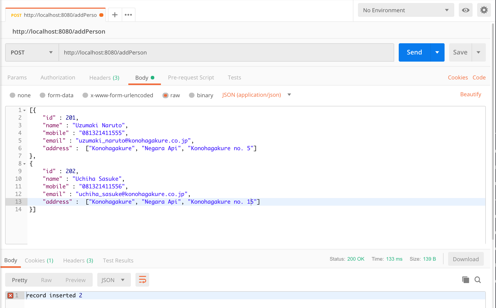
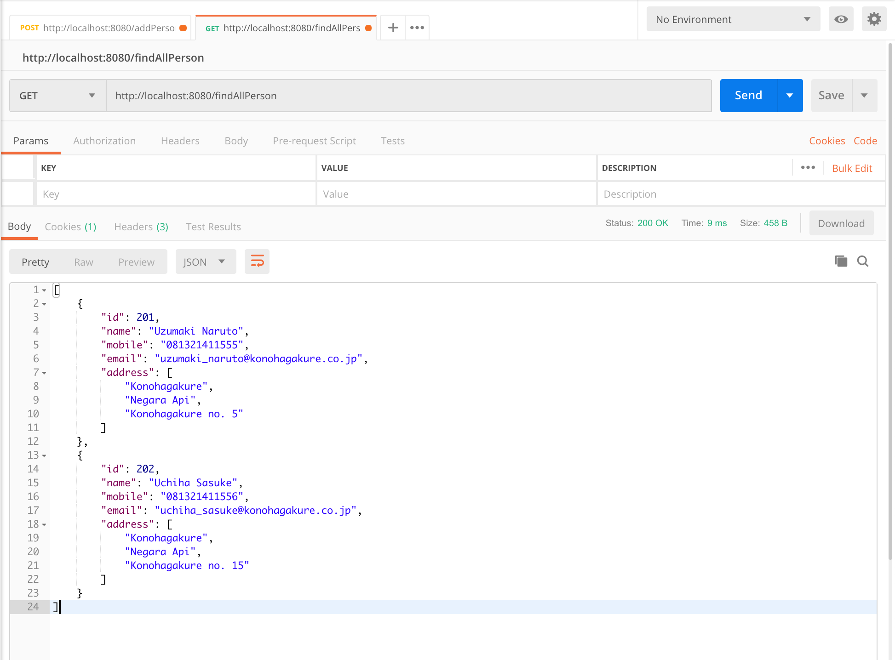
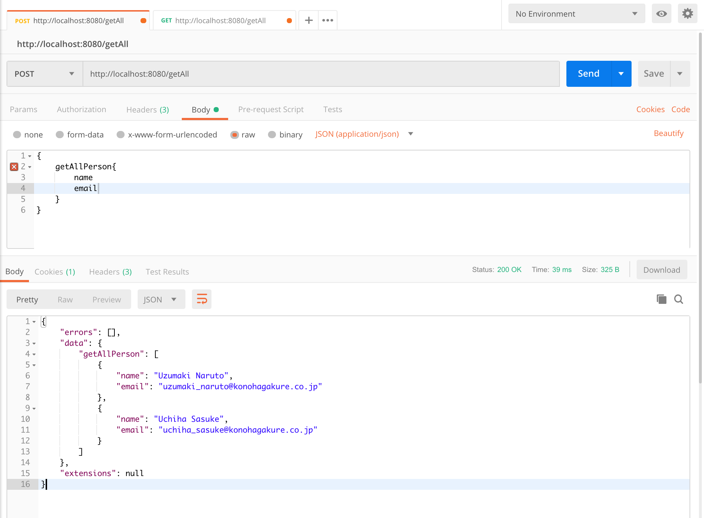

# spring-boot-graphQL-sample1

GraphQL is a relatively new concept from Facebook that is billed as an alternative to REST for Web APIs

Run this project by this command : `mvn clean spring-boot:run`

### Screenshot

Add Person API - `POST /addPerson`

Find Person API - `GET /findPerson`

Get All Person API - `POST /getAll`

